# The example catalog

Every example in the suite, grouped the way `bb examples` groups them. Each is
one namespace under `raygui-examples/src/net/b12n/raygui_jnk/`.

```sh
bb <name>          # run one, windowed. Q quits.
bb run-all [secs]  # cycle all of them, a demo reel
bb shot <name>     # run headless and screenshot to /tmp/<name>.png
bb examples        # this grouping, printed live
bb info            # every task, grouped, not just these
```

`scripts/examples_registry.clj` is the single source of truth for the names and
descriptions below, and `bb examples` fails if a `bb.edn` task drifts from it.
Run that for the count that is true right now rather than this page's memory of
it. At the time of writing there are **24 examples across 7 groups**, and the suite is complete.

Screenshots are captured by the same `bb shot` task the gates use. None of them
shows an interaction, because no gate here can drive a mouse.

## basics

| preview | `bb` name | what it shows |
|---|---|---|
| [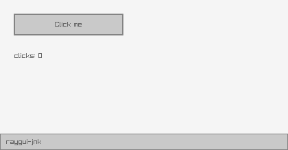](../demos/basic-controls.png) | `basic-controls` | The smallest complete program here: a button, a label and a click counter. It proves the package built, the bounds arrived intact, and an int cell round-tripped through raygui's pointer API. |
| [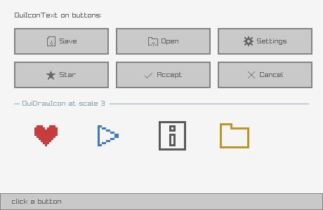](../demos/icon-buttons.png) | `icon-buttons` | raygui carries 256 icons inside the header, so there is no image to load. `GuiIconText` composes one with a label for any control, `GuiDrawIcon` draws it directly. The scale is global and persists until it is set back. |
| [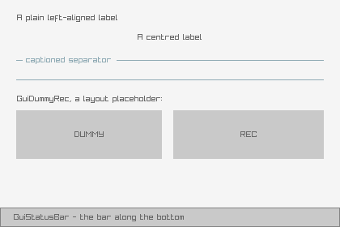](../demos/labels-lines.png) | `labels-lines` | The controls that draw and hold nothing: labels at two alignments, separators with and without a caption, a placeholder box, a status bar. Also the thing to watch about raygui styling, since `TEXT_ALIGNMENT` is global and has to be put back. |
| [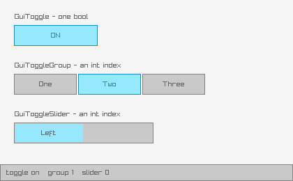](../demos/toggles.png) | `toggles` | Three controls that all hold a selection, with three different state shapes. `GuiToggle` owns a bool cell; `GuiToggleGroup` and `GuiToggleSlider` take their options as one semicolon-separated string and report an index through an int cell. |

## inputs

| preview | `bb` name | what it shows |
|---|---|---|
| [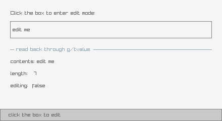](../demos/text-box.png) | `text-box` | The first mutable char buffer. Edit mode is a plain bool the caller owns rather than a cell, and the screenshot prints the buffer's length so a failed readback would be visible. |
| [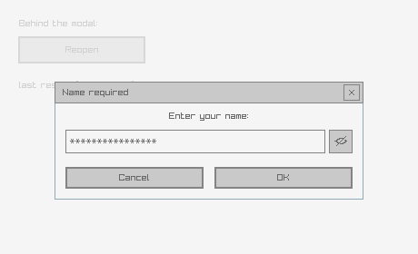](../demos/text-input-box.png) | `text-input-box` | A whole dialog in one call, including an out-param that raygui 5.0's docs do not show. The masked field always draws sixteen asterisks whatever the buffer holds, because raygui masks with a fixed literal. |
| [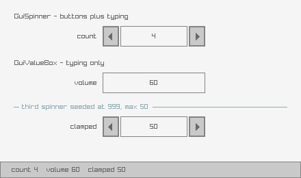](../demos/spinner-value-box.png) | `spinner-value-box` | Both hold an int cell and clamp to a range. The third spinner starts at 999 against a maximum of 50, so the screenshot shows the clamp holding rather than asserting that it does. |
| [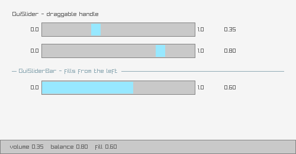](../demos/sliders.png) | `sliders` | `GuiSlider` has a draggable handle, `GuiSliderBar` fills from its left edge. Each value is drawn beside its control, so a cell that failed to round-trip would show up in the picture. |
| [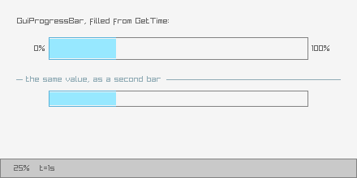](../demos/progress-bar.png) | `progress-bar` | Filled from `GetTime` rather than a frame counter. The only example that does not capture on frame 0, since an empty bar proves nothing. |

## collections

| preview | `bb` name | what it shows |
|---|---|---|
| [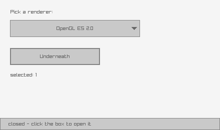](../demos/dropdown-box.png) | `dropdown-box` | Edit mode is a plain bool and the caller flips it. While the list is open the rest of the panel is locked and the dropdown draws last, or clicks fall through to whatever sits underneath. |
| [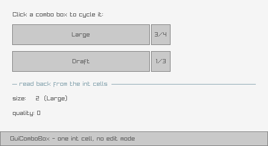](../demos/combo-box.png) | `combo-box` | The simple one. No edit mode, no overlay, no locking: clicking advances through the options and writes an int cell. |
| [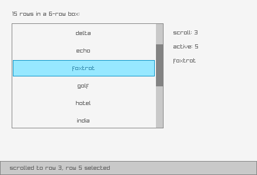](../demos/list-view.png) | `list-view` | Two int cells, a scroll index and an active row, over a semicolon-separated string. The scroll index is seeded non-zero, because a zero scroll looks the same as an unwired one. |
| [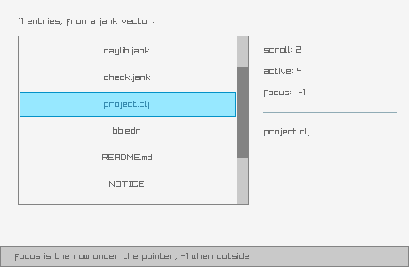](../demos/list-view-ex.png) | `list-view-ex` | The only control taking an array of strings rather than a joined one, and it adds a third out-param for the row under the pointer. The array is built and freed inside the wrapper, so examples pass a plain vector. |
| [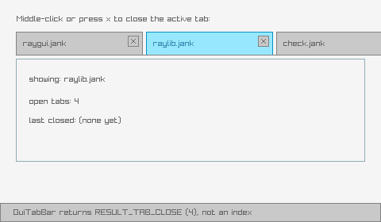](../demos/tab-bar.png) | `tab-bar` | Returns a result code rather than a tab index: the tab to close is the active one. Close buttons only appear when `TAB_CLOSE_BUTTON` is set on the tab bar. |

## containers

| preview | `bb` name | what it shows |
|---|---|---|
| [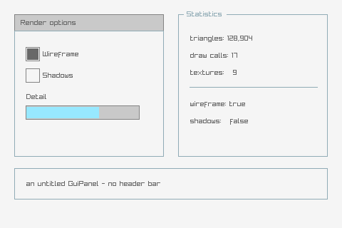](../demos/panel-group-box.png) | `panel-group-box` | Neither container clips its children or holds state. They draw a frame, and the caller places what goes inside. |
| [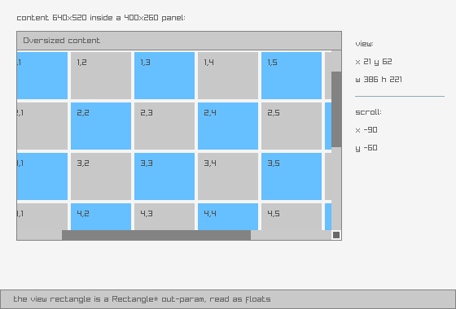](../demos/scroll-panel.png) | `scroll-panel` | The suite's only `Rectangle *` out-param. raygui reports the visible view back, which the example uses to scissor its content: 386 by 221 inside a 400 by 260 panel, once the scrollbars are subtracted. Ported from raygui's own example. |
| [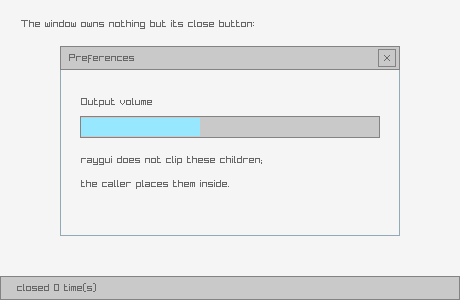](../demos/window-box.png) | `window-box` | Draws a titled frame and reports its close button, and manages nothing else. Visibility is a bool cell the caller keeps, along with a way back. |
| [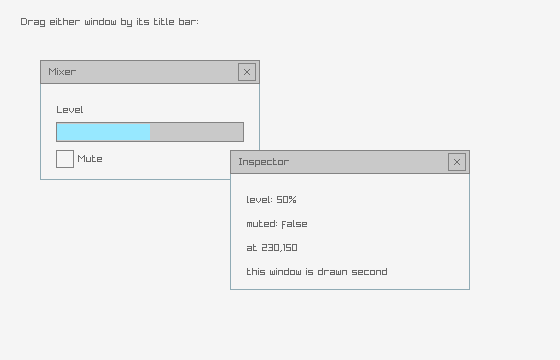](../demos/floating-window.png) | `floating-window` | Dragging is not a raygui feature. The title-bar hit test, the offset and the movement are all the caller's, in float cells. Ported from raygui's own example. The drag itself is not covered by any gate here. |

## dialogs

| preview | `bb` name | what it shows |
|---|---|---|
| [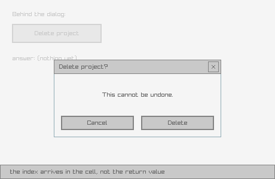](../demos/message-box.png) | `message-box` | Returns a result code and writes the button index into a cell: 0 for the window's own close button, then 1 upward in semicolon order. Modality is the caller's job, since raygui draws no scrim and blocks nothing. |
| [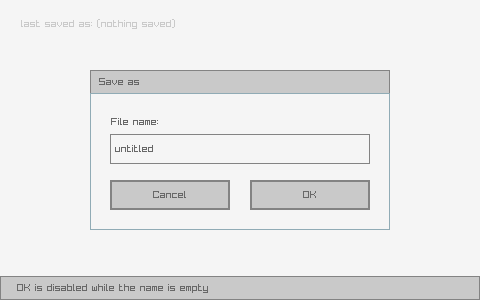](../demos/custom-input-box.png) | `custom-input-box` | The same dialog as `text-input-box`, assembled by hand from a panel, a label, a text box and two buttons. What that buys is validation: OK stays disabled while the field is empty. Ported from raygui's own example. |

## color

| preview | `bb` name | what it shows |
|---|---|---|
| [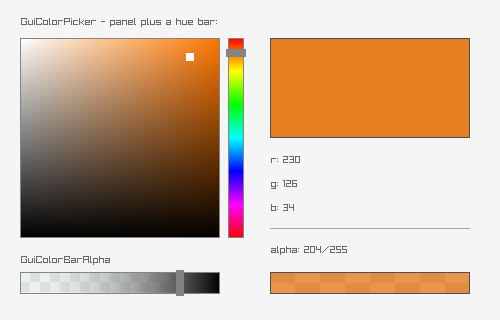](../demos/color-picker.png) | `color-picker` | A `Color *` cell, seeded a distinctive orange so a failed readback could not hide. The swatch is drawn from the cell's own components, and the alpha strip sits over a chequer so transparency is visible. |
| [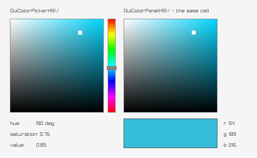](../demos/color-picker-hsv.png) | `color-picker-hsv` | Holds a `Vector3` of hue, saturation and value rather than a colour. The swatch converts back through `ColorFromHSV`, so both representations are on screen agreeing. |

## styling

| preview | `bb` name | what it shows |
|---|---|---|
| [](../demos/style-selector.png) | `style-selector` | Cycles the six vendored themes plus raygui's built-in default. Palette and embedded font both come from the `.rgs`. Shown here with `cyber`, since the default theme shows nothing about styling. Ported from raygui's own example. |
| [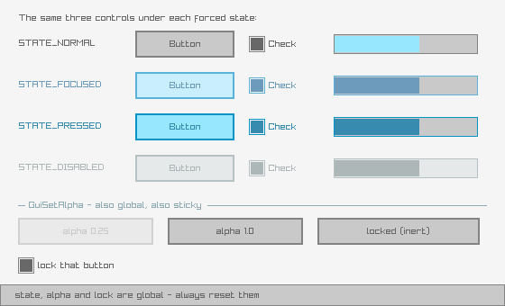](../demos/gui-state.png) | `gui-state` | The global-state API, which has no bounds of its own. The same three controls under each forced state, then alpha, then lock. All three are global and sticky, so every row resets immediately. |

## The six vendored themes

`style-selector` cycles these. Each `.rgs` carries a palette and its own
embedded font, and the font changing is the clearest sign the file loaded.

| theme | | theme | |
|---|---|---|---|
| `ashes` | 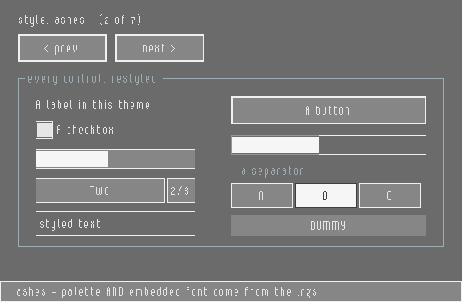 | `candy` | 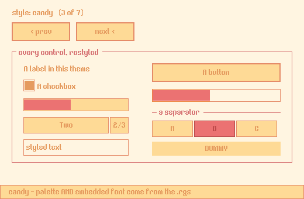 |
| `cyber` | 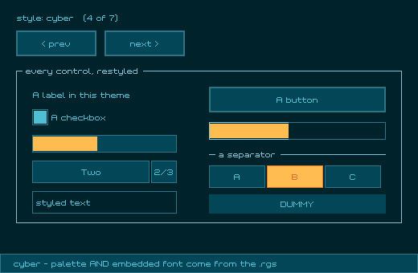 | `dark` | 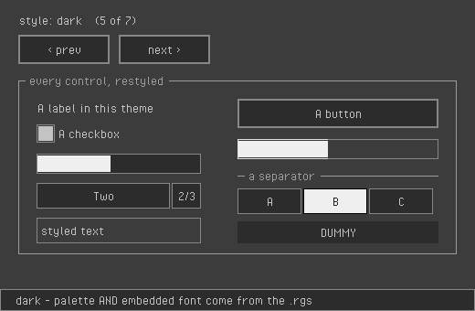 |
| `sunny` | 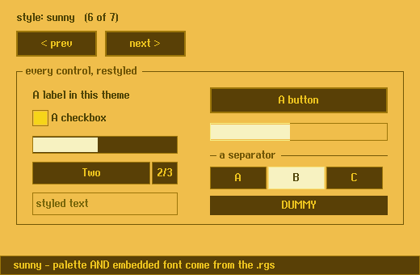 | `terminal` | 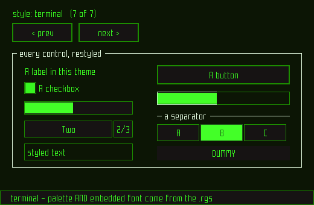 |
